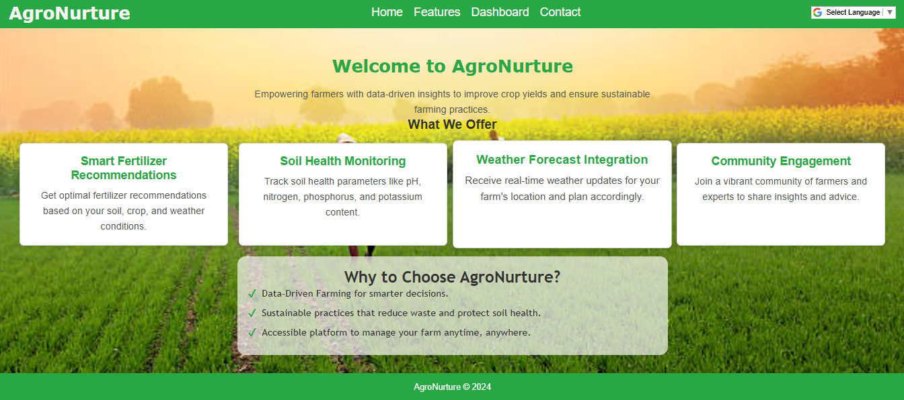
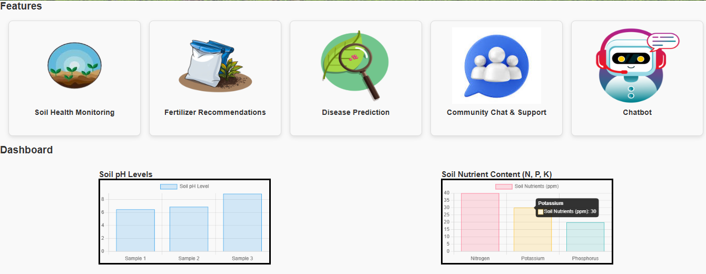
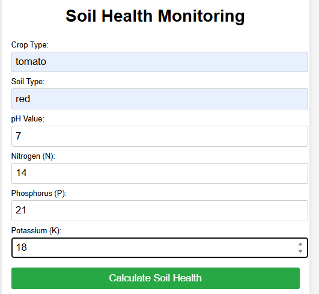
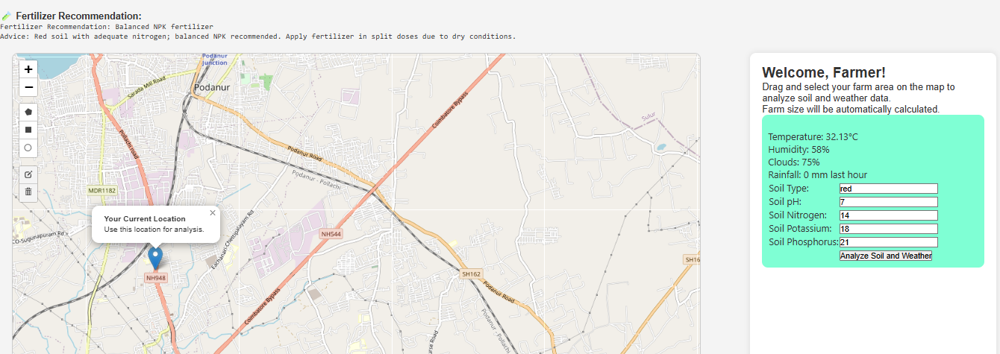

#AgroNurture  

AgroNurture is a smart fertilizer recommendation system that helps farmers optimize fertilizer use by analyzing soil data, crop type, weather, and nutrient levels to improve yield and promote sustainable farming.

---

## Features  
- Soil type detection  
- Personalized fertilizer recommendations with quantity & schedule  
- Weather-aware suggestions using real-time data  
- Yield prediction and soil health tracking  
- Simple dashboard for monitoring crop and soil status  

---

## How It Works  
1. Input soil pH, NPK levels, or upload a soil image  
2. Select the crop you plan to grow  
3. System fetches weather data and analyzes farm conditions  
4. AI model recommends fertilizer type, quantity, and intervals  
5. View results on a simple dashboard  

---

## Screenshots

!(Images/4.png)

